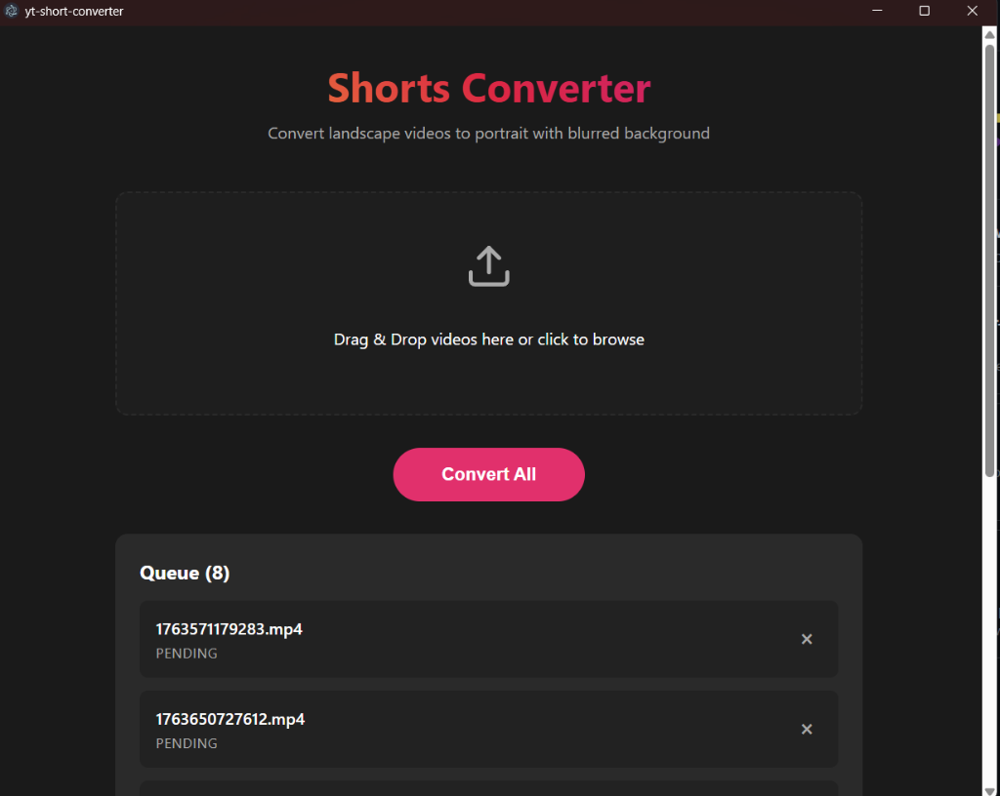

# YouTube Shorts Converter

A powerful desktop application built with Electron and React that automatically converts landscape videos into portrait mode (9:16) suitable for YouTube Shorts, Instagram Reels, and TikTok. It adds a blurred background to fill the empty space, ensuring a professional look.



## Features

-   **Automatic Conversion**: Converts 16:9 landscape videos to 9:16 portrait.
-   **Smart Background**: Adds a blurred version of the original video as the background.
-   **Batch Processing**: Drag and drop multiple videos to convert them all at once.
-   **Privacy Focused**: All processing happens locally on your machine using FFmpeg. No videos are uploaded to the cloud.
-   **Cross-Platform**: Compatible with Windows (and easily adaptable for Mac/Linux).

## Installation

### Option 1: Build from Source

1.  **Clone the repository**
    ```bash
    git clone https://github.com/AnikKazi-dev/YT-Shorts-Converter.git
    cd YT-Shorts-Converter
    ```

2.  **Install Dependencies**
    ```bash
    npm install
    ```

3.  **Run in Development Mode**
    ```bash
    npm run dev
    ```

    **Alternatively (Windows):**
    Simply double-click the `run.bat` file in the project folder to start the application.

4.  **Build for Production**
    To create an installer for your system:
    ```bash
    npm run build
    ```
    The installer will be located in the `dist` folder.

## Usage

1.  Open the application.
2.  Drag and drop your video files into the designated area.
3.  Click **Convert All**.
4.  The converted videos will be saved in the same directory as the original files with a `_portrait` suffix.

## Technologies Used

-   [Electron](https://www.electronjs.org/)
-   [React](https://reactjs.org/)
-   [Vite](https://vitejs.dev/)
-   [FFmpeg](https://ffmpeg.org/) (via `fluent-ffmpeg` and `ffmpeg-static`)

## License

MIT
